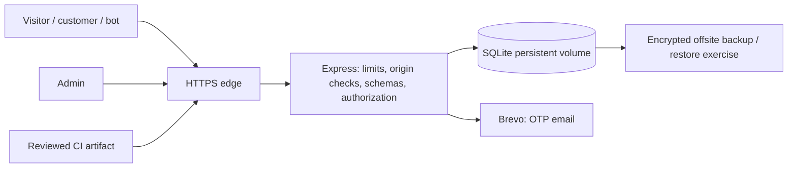

# Threat model

## Assets and trust boundaries

Protect admin authority, OTPs/sessions, customer email/phone/address/order history, catalogue prices, coupon quotas, order integrity, availability, SQLite and backups, deployment credentials and release artifacts. Browser state, cookies, request headers, IDs, JSON and all provider responses cross a trust boundary. Frontend validation is never authority. Database content is escaped on output even when authored by an admin.

There is no payment-provider data flow today. Cash orders start unpaid; adding online payment requires a new reviewed trust boundary, signature verification and atomic event processing. No file storage/upload service, worker, XML, GraphQL or WebSocket interface exists.

## Actors and STRIDE analysis

| Actor / boundary | Threats | Required controls / evidence |
| --- | --- | --- |
| Anonymous visitor / attacker / bot → API | Spoof identity, tamper prices/IDs, spam checkout/coupons/mail, large bodies, injection | Strict bounded schemas, authoritative catalogue pricing, per-class limits before parsing, no SQL input interpolation, generic failures |
| Customer A / B → account | Stolen session, BOLA, guest email misattribution, repudiation | Verified email, DB-backed sessions and revocation, profile ownership filtering, customer authorization tests, PII minimization |
| Guest → tracking | Sequential reference enumeration plus guessed phone leaks address | Tight tracking limits; minimize returned PII; do not call a phone number a secret or strong authentication; move to authenticated tracking for full details |
| Admin → management APIs | Privilege escalation, mass assignment, invalid fulfillment/payment states, repudiation | Server admin middleware, strict writable fields, status transition validation, audit trail; MFA/individual identities production requirement |
| OTP flow → DB / mail | Parallel verification replay, quota reset, CPU/memory exhaustion, provider timeout | Atomic reservation/consumption preserving quotas, bounded KDF concurrency, expiration/attempt caps, fixed outbound host and timeout |
| API → database/storage | SQL injection, partial writes, race, disk-full/locks, stolen files | Parameters, immediate transactions, constraints, restricted persistent volume, backup verification and safe 503 |
| Browser → static assets | Stored/DOM XSS, malicious URLs, framing, cache confusion | React escaping, no HTML sinks, restrictive image paths, CSP script hashes, frame-ancestors, hashed-only immutable cache |
| Proxy → API | Forged forwarding headers bypass limits or TLS expectations | Explicit trusted proxy CIDRs, canonical production origin, ingress TLS enforcement, private app port |
| CI/CD / dependencies | Secret leakage, malicious package/action, untested deployment | Frozen lockfile, secret/SAST/audit gates, minimal permissions, pinned actions, review and environment protection |
| Developer workstation | Accidental production seed/test/mail, stolen .env, compromised tools | Isolated test DB and cleared provider credentials, ignored local secrets, no production deployment from workstation, device/account hygiene |
| Backup / monitoring operator | PII disclosure, undetected compromise, missing recovery | Encryption/access controls/retention, sanitized structured logs, alert routing, actual restore rehearsal |

## Critical atomic operations

Order + lines + customer totals + coupon use + reference + idempotency record must commit together. Status + history + audit must commit together. OTP attempt reservation must occur before asynchronous KDF work, and success must conditionally consume that exact code version once. Login creates a new revocable session; logout revokes it in the database before clearing the cookie.

## Residual assumptions

One writable SQLite instance on durable local storage. Horizontal replicas require a shared transactional database and distributed limits; a shared SQLite file over a network mount is not a substitute. Shared admin credentials lack individual attribution and MFA. Edge TLS, actual backup scheduling, restore history, alerts and protected repository settings require deployment evidence before launch. No claim of exhaustive attack elimination or ASVS certification.
